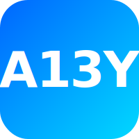

<div align="center">
  

  <h1>@a13y</h1>

  <p><strong>Type-safe accessibility enforcement layer for TypeScript</strong></p>

  [](https://www.npmjs.com/package/@a13y/core)
  [](https://opensource.org/licenses/MIT)
</div>

<br />

## Packages

This monorepo contains the following packages:

- **[@a13y/core](./packages/core)** - Framework-agnostic runtime utilities for accessibility
- **[@a13y/react](./packages/react)** - React hooks and components with 17+ WCAG 2.1 compliant components
- **[@a13y/devtools](./packages/devtools)** - Development-time validators and runtime checks

## Installation

```bash
# Install core utilities (framework-agnostic)
npm install @a13y/core

# Install React hooks and components
npm install @a13y/react

# Install devtools (optional, development only)
npm install -D @a13y/devtools
```

## Quick Start

```typescript
import { AccessibleDialog } from '@a13y/react';
import { announce } from '@a13y/core/runtime/announce';

function App() {
  const [isOpen, setIsOpen] = useState(false);

  return (
    <AccessibleDialog
      isOpen={isOpen}
      onClose={() => setIsOpen(false)}
      title="Settings"  // Required by type system
    >
      <p>Your content here</p>
    </AccessibleDialog>
  );
}
```

## Development

```bash
# Install dependencies
pnpm install

# Build all packages
pnpm build

# Run tests
pnpm test

# Type check
pnpm typecheck
```

## Author

Created and maintained by **Diego Aneli** ([@DiegoAneli](https://github.com/DiegoAneli))

Contributions are welcome! See our contributing guidelines.

## License

MIT © Diego Aneli and contributors
